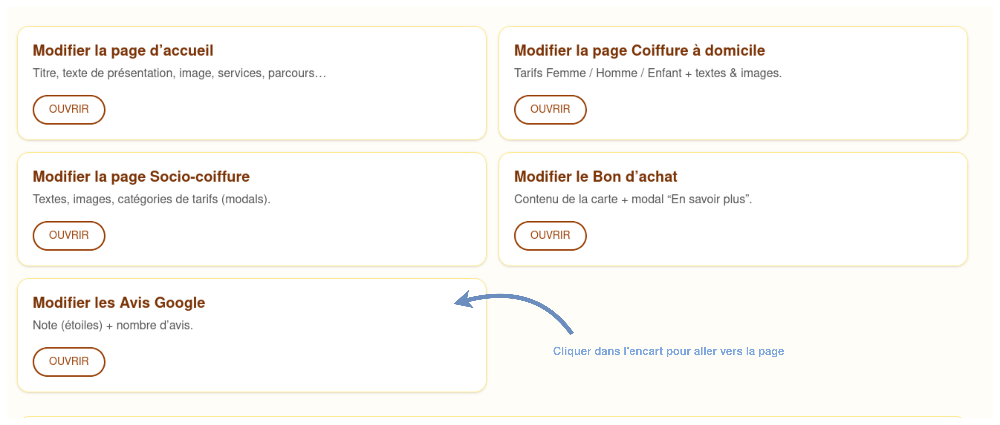
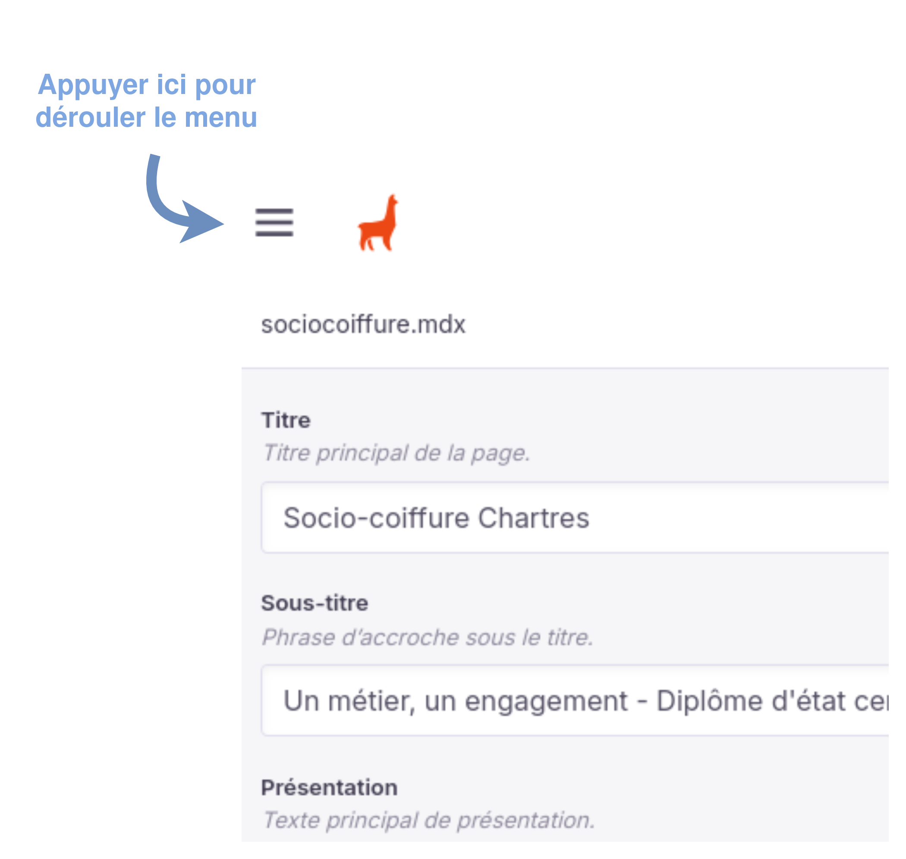
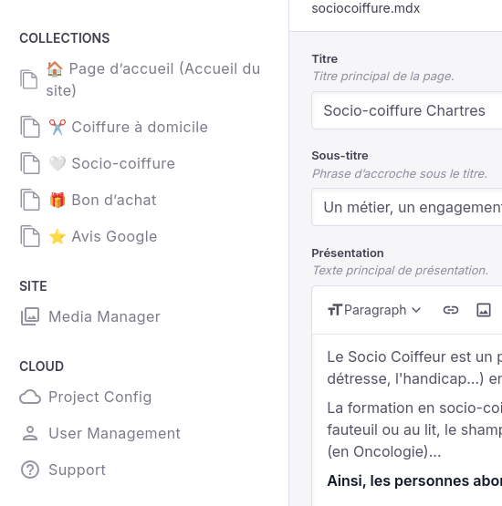

# Page d'accueil du site d'administration
La page d'accueil du site d'administration se situe à l'adresse [coiffeuse-chartres.vercel.app/admin](https://coiffeuse-chartres.vercel.app/admin).

D'ici, vous pouvez **choisir ce que vous souhaitez modifier**, simplement en cliquant sur les cases "Modifier".

Chacun des éléments que vous pouvez modifier est décrit dans cette docuementation:
- [Modifier le contenu des pages](modifier_pages.md)
- [Modifier les avis google](modifier_avis_google.md)
- [Modifier le bon d'achat](modifier_bon_dachat.md)

Depuis une page de modification, vous pouvez accéder à toutes les pages depuis le menu en haut à gauche, puis en choisissant ce que vous souhaitez modifier.

*Veuillez ne pas cliquer sur les boutons qui ne sont pas dans la catégorie Collections: ceux ci vous renverraient vers une page de configuration qui ne vous interesse pas.*