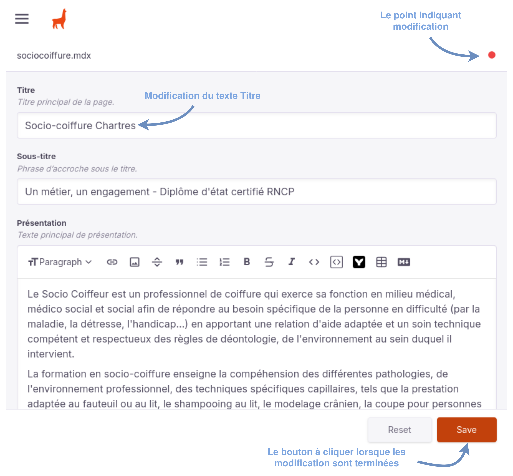
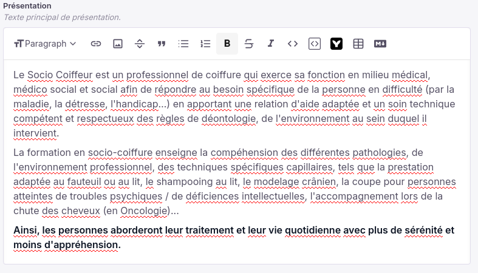
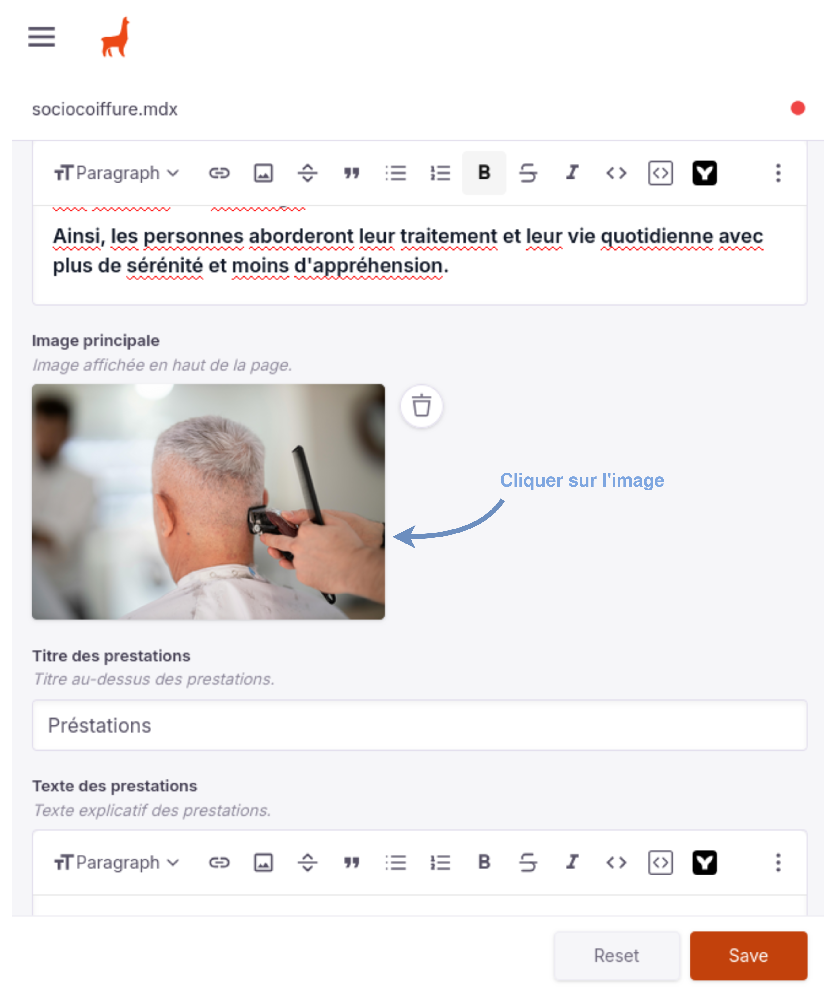
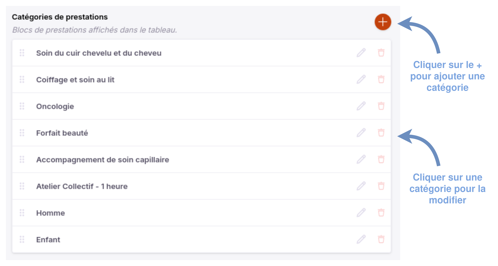
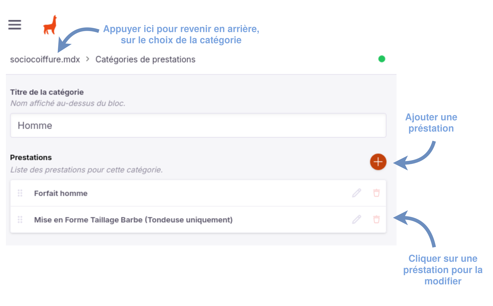

# Modifier le contenu des pages
Cette page explique comment modifier le contenu des pages.

## Modification d'un élément textuel
Pour chaque modification, il faut cliquer sur "save" (sauvegarder) pour que la modification prenne effet. Un petit point orange apparaitra en haut à droite indiquant que des changement n'ont pas été sauvegardés. Par exemple avec le *Titre*:

Dans les textes plus riches (avec paragraphe, italique, gras etc), **il est interdit de mettre une image même si cela est possible**. En revanche, vous pouvez mettre de l'italique, du texte en gras, des paragraphes etc.

## Modification d'une image
Les images peuvent être modifiées en cliquant sur une image. 

Une fois l'image cliquer, un encart s'ouvrira pour que vous puissiez soit:

- remplacer l'image par **une présente déjà sur le site**,
- remplacer l'image par **une image que vous devrez ajouter au site**.

### Remplacer par une image présente sur le site
Une fois que vous avez cliquer sur le site, vous arriverez sur cette interface:

Vous pouvez alors choisir parmis les image que vous voyes ici, simplement en cliquant dessus.

### Remplacer par une image non présente sur le site
Si vous souhaitez remplacer l'image par une autre image qui n'est pas présente sur le site, vous pouvez le faire à l'aide du bouton Upload ("publier").

## Modification des tarifs
Les tarifs sont organisés en catégories sous forme de liste. Par exemple la catégorie "Homme" contient deux préstations: "Forfait homme" et "Mise en Forme Taillage Barbe (Tondeuse uniquement)".

### Modification des catégories de tarifs

Vous pouvez:

- Ajouter, supprimer, modifier des catégories,
- Ajouter, supprimer, modifier les préstations dans les catégories.

### Modification des préstations des catégories de tarifs

